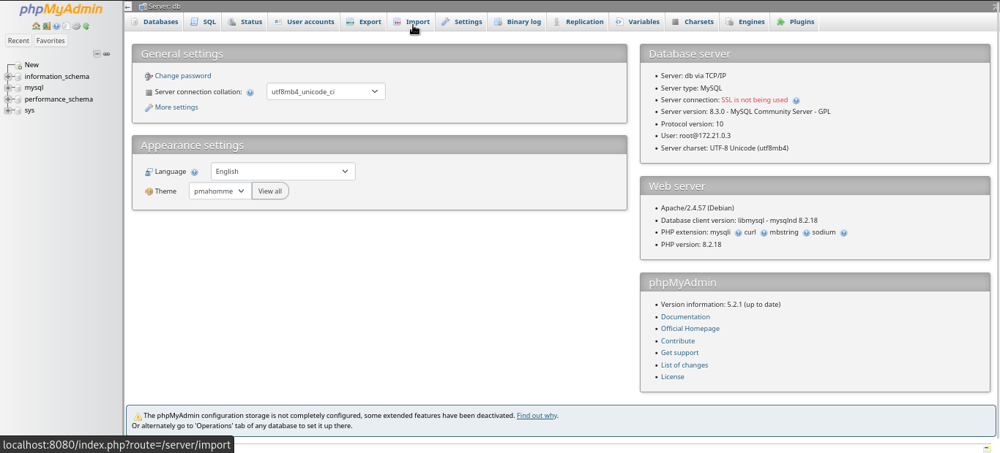
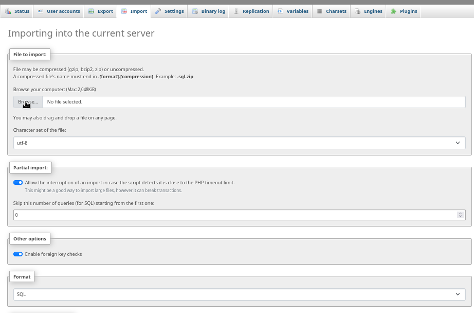
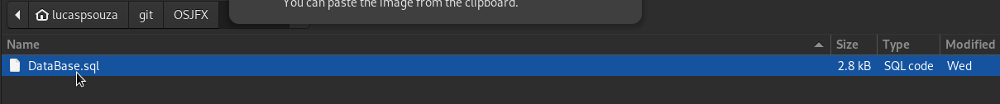
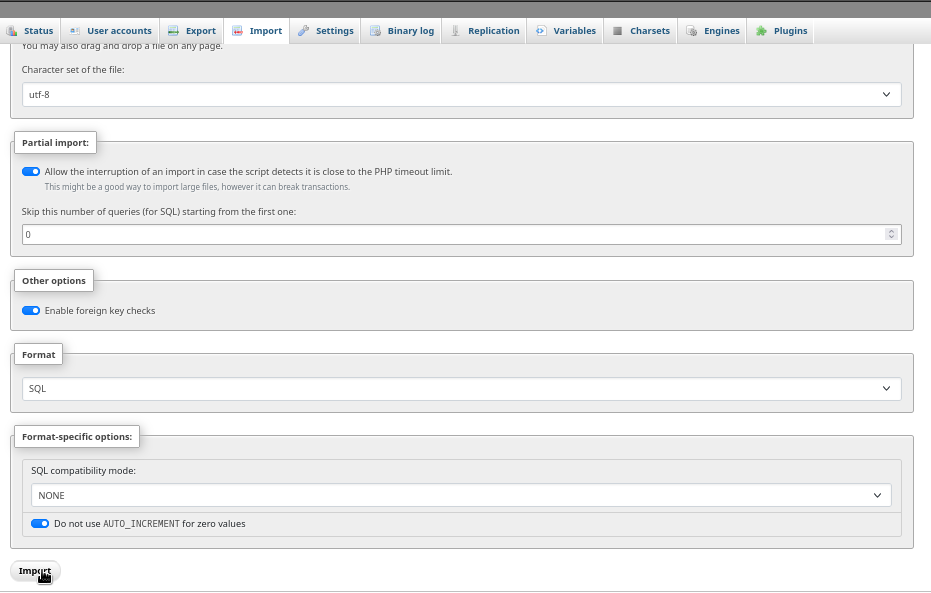

## Aplicação para Sistema de Gestão e serviços

#### PT-BR manual and installation here: <a href="readme_pt-br/">README_PT-BR</a>

> ### Serviços utilizados:
| MYSQL  | JAVA   | DOCKER | or | Xampp |
|--------|--------|--------| -- | ----- |
| 8.0.32 | 17.0.6 | Latest | -- | Latest |
____________________________
## Installation
##### <small> docker and xampp choice is opcional, but you need to choose one </small>

### Manual and Java installation
#### https://www.java.com/pt-BR/download/manual.jsp


### Docker manual and installation
#### https://docs.docker.com/engine/install/
### Xampp Website for installation
#### https://www.apachefriends.org/pt_br/index.html
____
## Docker compose <a href="https://hub.docker.com/"></img></a>
### In your directory, make or get from my repository [/docker/docker-compose.yaml] docker-compose.yaml
_____
### or use wget
```bash
wget https://github.com/lucaspereirasouza/OSJFX/blob/master/docker/docker-compose.yaml
```

#### warning: its possible to refuse connection if you try to connect to fast on docker
___
## Xampp <a href="https://www.apachefriends.org/pt_br/index.html"></img></a>
## After finish xampp installation, turn on the apache and mysql servers and acess the local host 
### <small>detail: xampp local acess has not login in localhost</small>
____

#### <small> I suggest using root only for insert the database and nothing else </small>
- user: root
- senha: root@passwd@changeme
____
### Xampp URL
#### http://localhost/phpmyadmin/

### Container URL:
### 127.0.0.1:8080
## phpMyAdmin database importation:


## <small> in directory /database/, insert the SQL file </small>


____
## Aplication admin login:
- user: admin
- pasword: admin

## Application Login

## Menu

## User creation

## Clients

## Services

## Stock managment

## Services and client PDF


____
#### made by:
#### Lucas pereira de souza

#### autor and java windows Builder course teacher:
#### <a href="https://github.com/professorjosedeassis">Professor José de assis</a>


